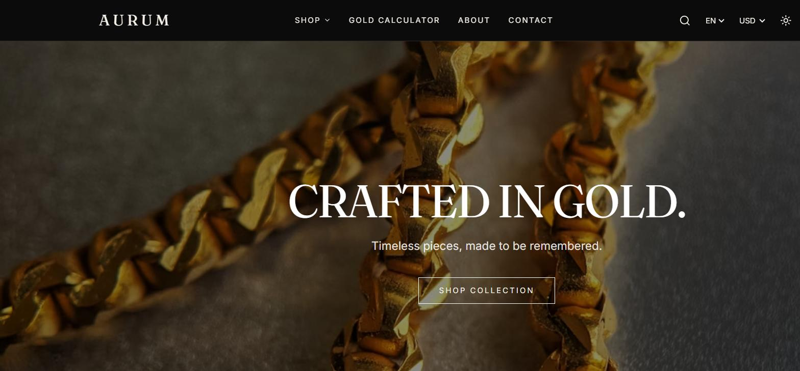
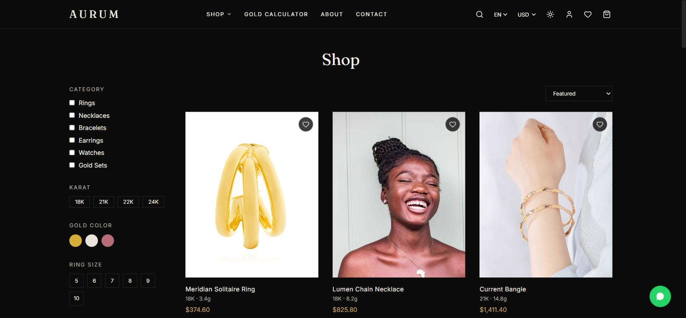
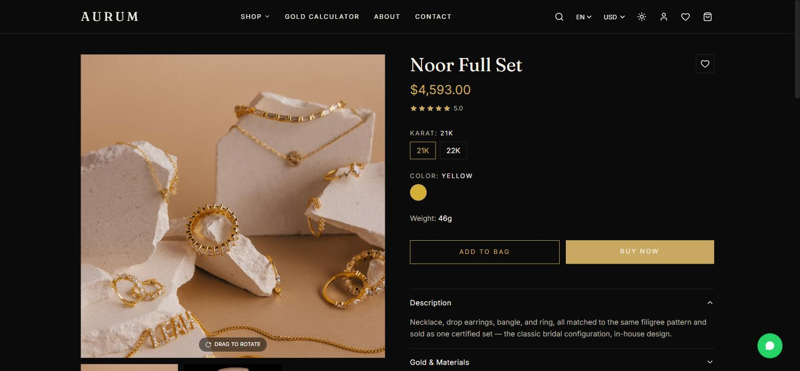
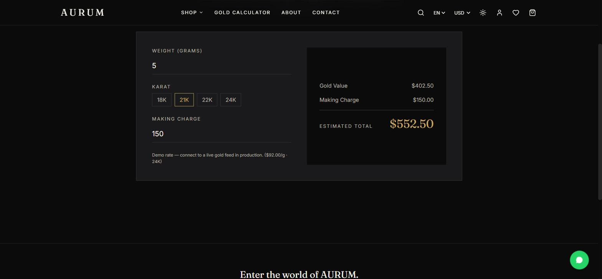
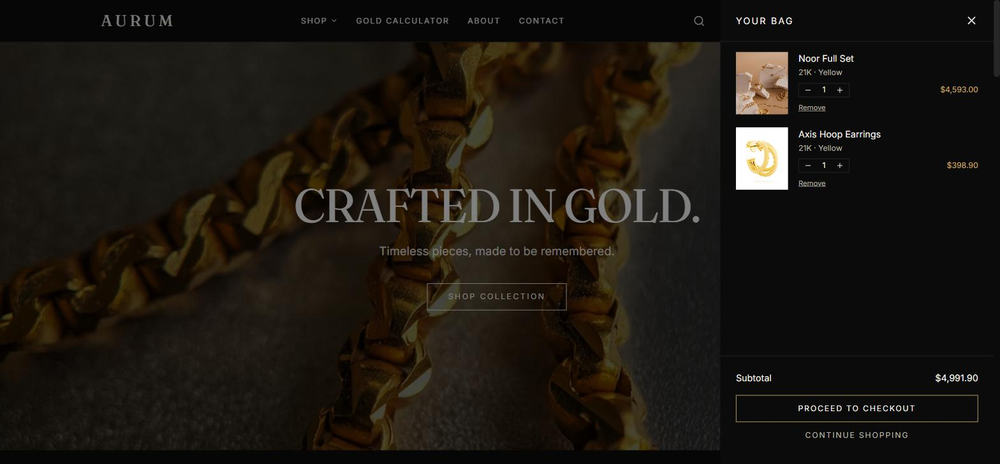
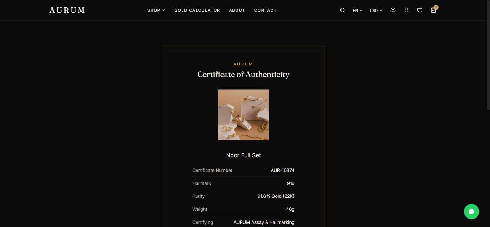

# AURUM — Luxury Gold Jewelry Commerce

A complete, production-ready e-commerce storefront template built specifically for **gold shops, jewelers, and jewelry brands** — karats, gram weight, making charges, and certificates are first-class, not bolted on. Dark-luxury design system with an ivory light mode, full Arabic/English bilingual support with true RTL layout, and a live Gold Price Calculator as the signature feature.

**[Buy the source — $49](https://muadme.gumroad.com/l/aurum)** · **[Live demo](https://aurum-template-muad1.vercel.app)**

## Stack

React 18 · TypeScript · Vite · Tailwind CSS v4 · Framer Motion · Zustand · React Router v6 · React Hook Form · Zod

## Features

- 14 routes: Home, Shop, Collection (per category + New Arrivals), Product Detail, Search, Cart, Wishlist, Checkout, Gold Calculator, Certificate, About, Contact, Account, 404
- **Gold Price Calculator** — standalone page and embeddable widget, live karat-adjusted breakdown (gold value + making charge = total), currency-aware
- Karat (18K/21K/22K/24K) and gold color (Yellow/White/Rose) selectors on every product, recomputing price live
- Certificate of Authenticity page per product (hallmark, purity, certifying body)
- Full Arabic/English i18n with automatic RTL layout mirroring (nav, product grid, calculator, checkout all verified)
- Currency switch (USD/EUR/MAD) with static, clearly-commented exchange rates
- Dark-luxury mode by default with an ivory light mode toggle
- Cart drawer + dedicated cart page, wishlist, multi-step checkout (Shipping → Payment → Review) with React Hook Form + Zod
- Floating WhatsApp contact button on every page
- 22 mock products across 6 categories (Rings, Necklaces, Bracelets, Earrings, Watches, Gold Sets)
- Mock 360° product viewer (drag to rotate through available images)
- Mobile responsive, route-based code-splitting ready

## About this repository

This repo is a showcase — screenshots and a feature overview only. The full source (React + TypeScript + Tailwind, ready to run with `npm install && npm run dev`) is a one-time purchase on Gumroad above.

## Image sourcing note

Every placeholder photo in the template was individually fetched and visually inspected before inclusion — two candidates showing real trademarked watch dials were found and rejected, and only genuinely free-license imagery was kept.
